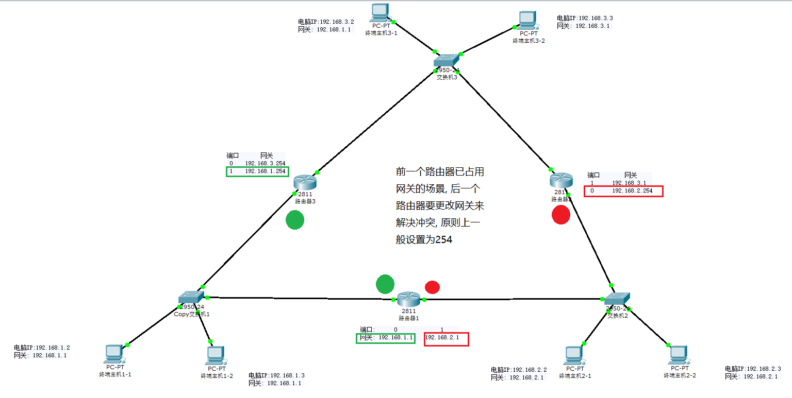
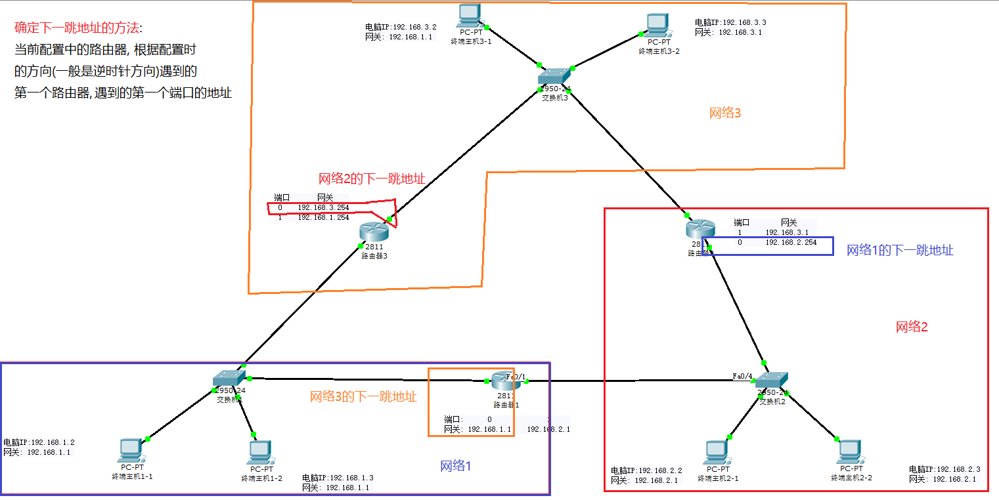

[toc]


# Cisco Packet Tracer计网模拟配置方法总结
如题所示


---
---


## 设备连接规则
1. 终端PC与交换机连接
2. 交换机与路由器连接
3. 路由器连接的一定是两个交换机, 作为两个网络通信的设备


---
---


## 计算路由器、交换机需要的个数
路由器个数 = 交换机个数 = 网络个数


---
---


## 2811路由器两个端口的配置原则
1. 必须为两个网络之间的网关
2. 对于三个网络以上, 前一个路由器已占用网关的场景, 后一个路由器要更改网关来解决冲突, 原则上一般设置为254(**255不能用, 是多播地址**)




---
---


## 2811路由器的静态路由表配置原则
1. 每个路由的静态路由表条目数 = 网络数 - 1&nbsp;&nbsp;&nbsp;&nbsp;(==不是请仔细检查, 不排除少于该数但是能全部ping通的情况, 但是这样不规范而且会发现延迟很高==)
2. 目标网络(Network)填写的是网络地址, **注意与网关区分**, 一般网络地址在未划分子网的情况下下结尾为0<u>(==不要过分依赖这样的判断方法==)</u>
    ``` json
    // 标准(未划分子网)网络地址示例:

    // A类地址
    85.0.0.0
    // B类地址
    168.16.0.0
    // C类地址
    200.38.42.0
    ```
3. 子网掩码(Mask)是根据目标网络填写的
4. 配置时要始终按照一个方向, 顺时针或逆时针, **一般是根据逆时针方向配置**, 这样比较方便后面配置静态路由表
5. 每个路由器的下一跳地址是固定的, 配置时只需把重心放在目标网络及其子网掩码上
6. **确定下一跳的值(Next Hop)**: 当前配置中的路由器, 根据配置时的方向(逆时针方向)遇到的第一个路由器, 遇到的第一个端口的地址/网关(实在不懂的小伙伴可以试试`FastEthernet0/0`, 一般都是这个口)
    


---
---


### 关于添加静态路由规则的%Inconsistent address and mask错误
根据我实验的经验判断, 需要排除的可能, 根据可能性从高到低如以下所示:
1. 目标网络或下一跳的地址已经子网划分过了, 这种情况最轻是子网掩码填写错误的问题, 最重的是整个所有项目的网络地址都配置错了, 需要重新规划
    ``` json
    // 示例:

    // A类的目标网络地址, 没有子网划分
    85.0.0.0
    // 所以正确的子网掩码为
    255.0.0.0


    // B类目标网络地址, 子网划分过(子网号: 2bit)
    85.198.0.0
    85.199.0.0
    85.134.0.0
    85.135.0.0
    // 所以正确的子网掩码为
    255.192.0.0
    ```
2. 子网掩码不匹配当前的目标网络, 重新输入
3. 目标网络、子网掩码、下一跳的地址任意的一个或多个填写错误, 需要仔细检查
4. 把子网掩码错认为是(匹配)下一跳的, **应该是根据目标网络填写**


---
---


## 附上两个简单的实验文件
去github上将两个`pkt文件`拉下来然后用`Cisco Packet Tracer软件`打开, 点开每个PC终端、路由查看它们的配置, 给看不懂的小伙伴结合着来学


其中`三个网络`是简单的, 可以先看。`六个网络`是稍微复杂一点的

[github下载链接](https://github.com/ChinaFitz/Cisco_computer_network_configuration_summary)